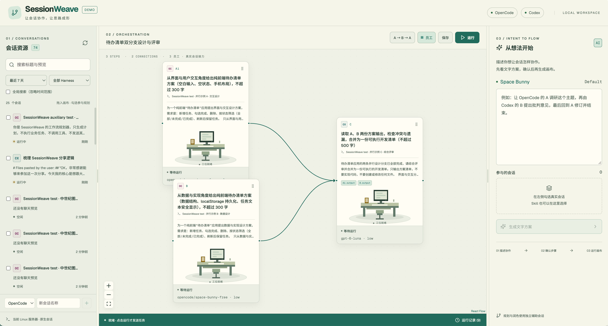
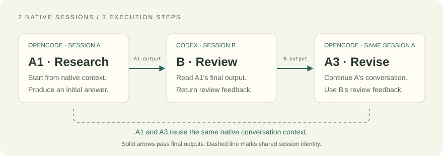

<p align="center">
  
</p>

<h1 align="center">SessionWeave</h1>

<p align="center"><strong>Turn your Codex and OpenCode sessions into visual workflows.</strong></p>
<p align="center">Reuse native conversation context across steps, pass final outputs between sessions, and inspect each handoff.</p>

<p align="center">
  <strong>Early Demo</strong> · Codex CLI + OpenCode TUI · Validated on Linux / Node.js 22<br />
  English · <a href="README.zh-CN.md">简体中文</a><br />
  <a href="#core-mechanics">How it works</a> · <a href="#quick-start">Quick start</a> · <a href="#current-limits-and-data-flow">Current limits</a>
</p>



<p align="center"><sub>Captured from the live desktop app: parallel A/B branches feed a review step C. The prepared workflow is waiting to run; its workstations show the ready state.</sub></p>

## Core mechanics

Keep the conversations you already use and make their handoffs explicit on a canvas.



| Concept | What it means |
| --- | --- |
| **Session** | An existing native Codex or OpenCode conversation, with its own history and model configuration. |
| **Step** | One task on the canvas. Multiple steps can reuse the same session. |
| **Handoff** | A snapshot of the final assistant answer from an upstream step in the current run, referenced as `{{A1.output}}`. Tool messages and reasoning are excluded. |

For example, **OpenCode A → Codex B → the same OpenCode A** can research, review, and revise. A1 and A3 retain A's native context; B receives A1's final answer. This is a three-step DAG, with two sessions and three workstations.

## Quick start

### Prerequisites

The current demo connects to services on **one host**. Have these ready before starting:

- **Node.js 22** and npm.
- An authenticated **Codex CLI**, accessible through its shared app-server daemon.
- A running **OpenCode 2.x** service and a readable service configuration JSON file.
- Your business sessions' models configured and authenticated in their native clients.

> **Two separate model paths:** workflow steps use each native session's model and reasoning effort. Natural-language planning and optional handoff polishing use independent OpenCode helper sessions with the currently hardcoded `opencode/space-bunny-free` model. This helper model must be available in your OpenCode service.

```bash
git clone git@github.com:lujunxi57/SessionWeave.git
cd SessionWeave
npm ci
npm run dev
```

Open **http://127.0.0.1:8787**. Repository access currently requires GitHub permission.

For production mode:

```bash
npm run build
npm start
```

When the services run on an SSH host, forward the web port from your local machine:

```bash
ssh -N -L 8787:127.0.0.1:8787 <your-ssh-host>
```

### Your first workflow

1. Drag existing sessions from the left sidebar onto the canvas, or select two sessions and use **A → B → A**.
2. Edit the purpose and prompt for each step; connect steps and reference upstream final outputs.
3. Alternatively, select participating sessions and describe the collaboration in the planning panel. Review the editable text plan before confirming the canvas.
4. Click **Run** to dispatch business tasks. Inspect step states, actual inputs, final outputs, and errors in the run records.

Creating or editing a canvas does not dispatch business tasks. Generating a text plan does call the independent planning model.

## Capabilities

| Capability | Current behavior |
| --- | --- |
| **Discover native sessions** | Browse Codex and OpenCode conversations, sort by recent activity, and filter by title/preview, time range, and harness. |
| **Plan and edit visually** | Build workflows manually or convert an editable natural-language plan into steps and connections. |
| **Keep native configuration** | Use native Skills and file attachments. Select models and reasoning effort from the harness's available catalog. Model changes affect the whole session; busy sessions cannot be changed. |
| **Listen and queue** | Observe an in-flight round started in the original client, wait for busy sessions, and pause later dispatches. |
| **Inspect execution** | Review the input actually sent, final-output snapshots, status changes, and errors for each run. |
| **See sessions as employees** | One session maps to one pixel employee and each step to a workstation. Movement, typing, approval waits, failures, and output handoffs follow execution state. The overlay is optional and respects reduced motion. |

## Connection configuration

| Environment variable | Purpose | Default / discovery |
| --- | --- | --- |
| `CODEX_SOCKET` | Shared Codex daemon socket | Discovered with `codex app-server daemon version` |
| `OPENCODE_URL` | OpenCode service URL | `http://127.0.0.1:49374` |
| `OPENCODE_SERVICE_FILE` | OpenCode service configuration | `~/.config/opencode/service.json` |
| `OPENCODE_SERVER_PASSWORD` | Override OpenCode service password | Read from the service configuration |
| `PORT` | Web server port | `8787` |

The current OpenCode adapter always reads the configuration file, including its `password` field. A readable JSON file is required even when URL/password environment overrides are supplied. Service credentials are read by the backend and are not sent to the browser.

## Current limits and data flow

- **Early, single-host demo.** Current integrations are Codex and OpenCode; Linux with Node.js 22 is the validated environment.
- **Native clients remain part of the workflow.** Handle permission approvals, full terminal interaction, and client-specific management commands in the original CLI/TUI. The web app shows approval waits.
- **Finite workflows.** Pause prevents later dispatches while in-flight tasks continue. Mid-run graph changes, immediate interruption, and general loops are not implemented.
- **Partial editor parity.** Skill completion, input history, file attachments, and output references are supported. Full file/agent `@` menus, Shell mode, and snippets are not implemented. Search covers titles and previews, not full conversation text.
- **Local records, provider-backed inference.** Workflow/run records are stored in `.sessionweave/`. Browser closure does not stop the backend. A backend restart preserves snapshots and marks unfinished runs as failed; it does not replay them automatically. Inputs and upstream final outputs reach models through the configured native harnesses and their providers, including the helper model when planning/polishing is used.
- **State-driven pixel animation.** The overlay represents execution states; it does not yet distinguish individual file-read, edit, or test tool actions.

## Development

```bash
npm test
npm run build
```

Unit tests use mock adapters for scheduling, final-answer ownership, model inheritance, and pixel states; they do not send tasks to real harnesses.

The optional pixel UI check requires a running web server and Playwright Chromium:

```bash
npx playwright install chromium
npm run test:browser
```

`DEMO_URL` overrides the check URL. This check intercepts APIs and uses mock sessions/run states. It does not modify native sessions, models, or saved workflows. No screenshots or reports are written by default; set `ARTIFACT_DIR` to retain check artifacts.

Built with **React, TypeScript, React Flow, CodeMirror, and Fastify**, using native protocols to connect Codex and OpenCode.

## Credits

SessionWeave uses work from **OpenChamber**, **Harnss**, **React Flow**, **Sage Paper Light**, and **Pixel Agents**, with character sprites credited to **JIK-A-4 / MetroCity**. Source snapshots and third-party license texts are preserved in [THIRD_PARTY_NOTICES.md](THIRD_PARTY_NOTICES.md); sprite provenance is in [public/pixel/characters/sources.json](public/pixel/characters/sources.json).
