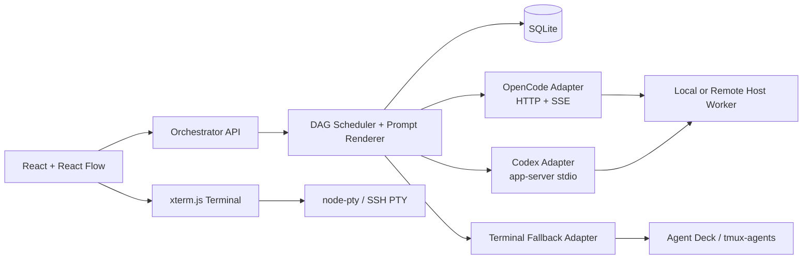

# 多 Harness 会话编排项目：开源仓库调研与复用建议

> 调研时间：2026-09-21  
> 项目范围：以 OpenCode 与 Codex 为主要 Harness，管理真实会话，并通过可视化 DAG 将上游输出传给下游会话。

## 一、结论

这个项目不需要从“控制终端、识别会话、判断完成”开始重写。OpenCode 和 Codex 都已有原生可编程接口：

- OpenCode 使用官方 Server、OpenAPI、TypeScript SDK 和 SSE。
- Codex 使用官方 `app-server` 协议及其生成的 TypeScript/JSON Schema。
- React Flow 负责工作流画布。
- xterm.js 负责需要人工接管时的终端界面。
- SQLite 负责工作流定义、运行状态、事件日志和恢复。
- Agent Deck、tmux-agents 只作为既有 tmux 会话和远程主机的兼容层。

长期架构应由自己的统一 `HarnessAdapter` 控制 OpenCode 与 Codex。不要把模拟键盘、截取终端文本、等待提示符作为主链路；这些手段适合作为无法接入原生协议时的兜底。

## 二、最值得直接使用的官方接口

### 1. OpenCode Server / SDK

仓库与文档：

- [anomalyco/opencode](https://github.com/anomalyco/opencode)
- [OpenCode Server 文档](https://dev.opencode.ai/docs/server/)
- [OpenCode TypeScript SDK](https://github.com/anomalyco/opencode/blob/dev/packages/web/src/content/docs/sdk.mdx)
- 许可证：[MIT](https://github.com/anomalyco/opencode/blob/dev/LICENSE)

OpenCode 的 TUI 本身就是 Server 的客户端。`opencode serve` 提供 HTTP API，`/doc` 提供 OpenAPI 3.1，`/event` 和 `/global/event` 提供 SSE。官方 SDK 包名为 `@opencode-ai/sdk`。

| 项目需要的能力 | 已有接口 |
|---|---|
| 查询会话 | `GET /session` |
| 新建会话 | `POST /session` |
| 查询运行状态 | `GET /session/status` |
| 发送提示词并等待回答 | `POST /session/:id/message` |
| 异步发送 | `POST /session/:id/prompt_async` |
| 读取消息和最终输出 | `GET /session/:id/message` |
| 实时事件 | `GET /event`、`GET /global/event` |
| 中止运行 | `POST /session/:id/abort` |
| 派生会话 | `POST /session/:id/fork` |
| 执行 `/command` | `POST /session/:id/command` |
| 响应权限申请 | `POST /session/:id/permissions/:permissionID` |
| 控制现有 TUI | `/tui/append-prompt`、`/tui/submit-prompt` 等 |

**可直接套用：** 用官方 SDK 实现 `OpenCodeAdapter`，包括发现、创建、恢复、发送、完成事件、输出提取、中止和 fork。输出只保留响应中 `text` 类型的 parts，即可排除工具调用内容。

**部署建议：** 启动受项目管理的 `opencode serve`，明确指定 host、port 和 `OPENCODE_SERVER_PASSWORD`。远程主机通过 SSH 隧道访问，不把接口直接暴露到公网。

### 2. Codex app-server

仓库与文档：

- [openai/codex](https://github.com/openai/codex)
- [Codex app-server 文档](https://learn.chatgpt.com/docs/app-server)
- [app-server 源码](https://github.com/openai/codex/tree/main/codex-rs/app-server)
- [协议类型定义](https://github.com/openai/codex/blob/main/codex-rs/app-server-protocol/src/protocol/v2/thread.rs)
- 许可证：[Apache-2.0](https://github.com/openai/codex/blob/main/LICENSE)

`app-server` 是 Codex 富客户端使用的协议层，支持会话历史、审批、流式事件和长期会话。它采用类似 JSON-RPC 2.0 的双向协议，默认使用 stdio；WebSocket 当前属于实验接口，首版应优先使用 stdio 或 Unix socket。

| 项目需要的能力 | 已有方法或事件 |
|---|---|
| 查询会话 | `thread/list`、`thread/read` |
| 新建会话 | `thread/start` |
| 恢复历史会话 | `thread/resume` |
| 派生会话 | `thread/fork` |
| 发送提示词 | `turn/start` |
| 运行时补充指令 | `turn/steer` |
| 中止运行 | `turn/interrupt` |
| 精确判断完成 | `turn/completed` |
| 状态更新 | `thread/status/changed` |
| 流式文本 | `item/agentMessage/delta`、`item/*` |
| 查询模型和推理等级 | `model/list` |

**可直接套用：** 实现 `CodexAdapter`，启动一个 `codex app-server` 子进程，按官方协议收发 JSONL。构建时调用 Codex 自带的 schema 生成命令，固定到已测试的 Codex 版本，避免手写协议类型。

**输出规则：** 只聚合 `agentMessage` 类型的 item，忽略命令、工具调用和文件变更 item。节点完成以 `turn/completed` 为准，不依赖终端提示符。

## 三、相关仓库分级

### A 级：建议直接依赖或通过稳定接口接入

| 仓库 | 可直接复用的部分 | 接入方式 | 判断 |
|---|---|---|---|
| [xyflow/xyflow](https://github.com/xyflow/xyflow) | 拖拽节点、连线、自定义节点、缩放、MiniMap、图状态 | npm `@xyflow/react` | 工作流画布首选；MIT |
| [xtermjs/xterm.js](https://github.com/xtermjs/xterm.js) | 浏览器终端、WebSocket attach、fit/search/webgl addons | npm `@xterm/xterm` | 人工查看和接管会话时直接用；MIT |
| [microsoft/node-pty](https://github.com/microsoft/node-pty) | 本地 PTY 创建、读写和尺寸调整 | npm `node-pty` | 仅在应用自己托管本地终端进程时使用；MIT |
| [mscdex/ssh2](https://github.com/mscdex/ssh2) | SSH exec、交互 shell、端口转发、SFTP | npm `ssh2` | 远程 Worker 安装、启动和隧道可直接使用；MIT |
| [WiseLibs/better-sqlite3](https://github.com/WiseLibs/better-sqlite3) | 单机 SQLite 访问和事务 | npm `better-sqlite3` | 个人使用阶段无需 Redis/Postgres；MIT |
| [statelyai/xstate](https://github.com/statelyai/xstate) | 可持久化状态机、事件驱动状态转换 | npm `xstate` | 可用于 Run/Node 生命周期；MIT；DAG 调度仍需自己写 |

其中 React Flow、xterm.js 和 SQLite 可以直接成为产品依赖。XState 是可选项：如果节点状态只有 `pending/running/succeeded/failed/paused`，自己写状态转换会更轻；如果后续要加入审批、重试、人工接管和恢复，XState 会减少状态分支错误。

### B 级：适合作为外部兼容层或摘取模块

#### Agent Deck

- 仓库：[asheshgoplani/agent-deck](https://github.com/asheshgoplani/agent-deck)
- [CLI Reference](https://github.com/asheshgoplani/agent-deck/blob/main/skills/agent-deck/references/cli-reference.md)
- 许可证：[MIT](https://github.com/asheshgoplani/agent-deck/blob/main/LICENSE)

这是调研中与本项目最接近的成熟仓库，已经支持 Codex、OpenCode、Claude 等多种工具，以及会话列表、状态、fork、远程主机、Web UI 和历史会话 recall。

它的 CLI 已有 JSON 输出，并提供：

- `agent-deck session send ... --message-file ... --wait/--stream --json`
- `agent-deck session output ... --json`
- `agent-deck remote sessions ... --json`
- 远程会话的 show/output/send/start/stop/restart/fork
- Codex/OpenCode 历史会话的 recall
- 完成事件 inbox

**建议用法：** 首版可以把 Agent Deck 当可选外部后端，通过子进程调用其 JSON CLI，快速获得 tmux 会话登记、远程主机和历史会话读取能力。自己的数据库只保存 `external_provider=agent-deck` 与外部 session id。

**不建议：** 将整个 Agent Deck fork 后作为产品核心。它的内部实现与 tmux、TUI 和自身状态库绑定较深，部分状态识别和输入投递仍有终端环境差异。原生 OpenCode/Codex adapter 应当是最终事实来源。

#### tmux-agents

- 仓库：[mattmight/tmux-agents](https://github.com/mattmight/tmux-agents)
- 许可证：MIT

提供 CLI 与 MCP 接口，可以发现本地和 SSH 远程 tmux 中的 agent、创建会话、发送文本、读取增量输出、等待和打标签。它目前对 Codex 等工具有现成检测，OpenCode 支持需要补充。

**建议用法：** 作为“未由本产品创建的老 tmux 会话”的 fallback adapter，或直接借用 SSH config 发现、pane capture 和 delta read 的实现。不要把 tmux pane id 当 Conversation 的永久身份。

#### adelost/agentmux

- 仓库：[adelost/agentmux](https://github.com/adelost/agentmux)
- 许可证：[MIT](https://github.com/adelost/agentmux/blob/main/LICENSE)

它最值得借用的是可靠消息投递：per-pane FIFO、单写入者、bracketed paste、投递状态、回执校验、进程重启后的去重与恢复。

**建议用法：** 参考或移植其投递队列状态机，供 tmux fallback adapter 使用。它以 Claude Code 和 Codex 为主，不能取代本项目的 OpenCode 原生接入。

#### codex-webui

- 仓库：[hydracz/codex-webui](https://github.com/hydracz/codex-webui)
- 许可证：MIT

这是一个小型 React/Vite + Node Web UI，使用 WebSocket、node-pty 和 tmux，并能在服务重启后重新发现会话。

**建议用法：** 摘取浏览器终端桥接、tmux 命名、重连和 systemd 安装脚本。项目规模较小且偏 Linux，不适合直接作为编排核心。

#### harness-exchange

- 仓库：[cnmoro/harness-exchange](https://github.com/cnmoro/harness-exchange)
- 许可证：MIT

可读取 Codex JSONL 和 OpenCode SQLite 会话，并在多种 Harness 间转换上下文。

**建议用法：** 后续实现“将同一任务从 Codex 切到 OpenCode继续”以及历史会话导入。首版不要直接修改各工具的内部数据库；优先走官方 import 或只读解析。

### C 级：可参考设计，不建议成为核心依赖

| 仓库 | 可参考内容 | 不作为核心的原因 |
|---|---|---|
| [twaldin/harness](https://github.com/twaldin/harness) | 多种 CLI 的统一命令构建、进程生命周期、一次性运行 | 定位是 subprocess library；Codex app-server 长期会话不是其核心能力 |
| [formiat/multi-agent-orchestration](https://github.com/formiat/multi-agent-orchestration) | 会话绑定、文件 inbox/outbox、checkpoint、事件日志 | 规模小，偏 Codex skill 和文件协议，没有通用运行时或图形界面 |
| [timvw/tmux-assistant-resurrect](https://github.com/timvw/tmux-assistant-resurrect) | 从进程和原生 session id 恢复 Codex/OpenCode tmux 会话 | 适合借鉴发现算法；复制代码前需再次核对许可证 |
| [markuswondrak/AgentMux](https://github.com/markuswondrak/AgentMux) | 固定状态机、共享 artifact、恢复、prompt 注入 | 仓库当前没有明确 LICENSE，不应复制代码 |

## 四、推荐的统一接口

不要让工作流引擎直接依赖 OpenCode HTTP 或 Codex JSON-RPC。定义一个小而稳定的内部接口：

```ts
interface HarnessAdapter {
  listConversations(host: HostRef): Promise<Conversation[]>;
  createConversation(input: CreateConversationInput): Promise<Conversation>;
  resumeConversation(ref: ConversationRef): Promise<void>;
  sendTurn(ref: ConversationRef, input: TurnInput): Promise<TurnRef>;
  subscribe(ref: ConversationRef, sink: EventSink): Promise<Unsubscribe>;
  readOutput(turn: TurnRef): Promise<AssistantOutput>;
  interrupt(turn: TurnRef): Promise<void>;
  forkConversation(ref: ConversationRef): Promise<Conversation>;
}
```

统一事件可缩减为：

```ts
type HarnessEvent =
  | { type: "conversation.status"; status: "idle" | "running" | "waiting" | "error" }
  | { type: "assistant.delta"; text: string }
  | { type: "permission.requested"; request: PermissionRequest }
  | { type: "turn.completed"; output: AssistantOutput }
  | { type: "turn.failed"; error: SerializedError };
```

这样工作流层只处理会话、节点、边、运行和事件，不知道底层协议差异。以后加入 Claude Code、Gemini CLI 或其他 Harness 时，只新增 adapter。

## 五、建议架构



远程主机建议运行一个很小的 Worker：

1. 本地 Orchestrator 通过 SSH 安装或启动 Worker。
2. Worker 在远端启动 OpenCode Server 或 Codex app-server。
3. 本地通过 SSH 隧道或一条加密 WebSocket 连接 Worker。
4. Worker 将不同 Harness 的事件转换为统一事件。
5. SQLite 中保存 Host、Conversation、Workflow、Run、NodeRun 和 append-only Event。

这比从浏览器直接 SSH 到每个会话更容易处理重连、升级、版本探测和恢复。

## 六、最快的 MVP 路线

### 阶段 1：单机原生协议

- React + `@xyflow/react`
- Node/TypeScript 后端
- SQLite + `better-sqlite3`
- `OpenCodeAdapter`：官方 SDK + SSE
- `CodexAdapter`：app-server stdio
- 支持节点、边、prompt 模板、运行、暂停下游调度、失败和恢复

这个阶段先不做 tmux 抓屏、浏览器终端和远程 Host。它已经能验证项目最核心的价值：真实会话之间的 DAG 编排。

### 阶段 2：人工接管与远程 Host

- xterm.js + node-pty
- ssh2 + SSH 隧道
- 远端轻量 Worker
- 权限申请、人工输入和重连

### 阶段 3：兼容既有终端会话

- Agent Deck JSON CLI adapter
- tmux-agents fallback adapter
- agentmux 的可靠投递与恢复机制
- harness-exchange 的历史会话导入与跨 Harness 转换

## 七、明确不建议做的事情

1. 不要用终端是否重新出现提示符来判断完成；使用 OpenCode SSE 和 Codex `turn/completed`。
2. 不要把 tmux pane id 当会话 id；持久身份使用 Harness 原生 session/thread id。
3. 不要让工作流节点直接等同于会话；同一 Conversation 可以出现在多个节点中，每次执行产生独立 NodeRun。
4. 不要在首版引入 Temporal、Redis/BullMQ 或 Kubernetes。个人使用的 SQLite 事务、事件日志和恢复扫描足以支撑 V0.1。
5. 不要直接修改 Codex/OpenCode 的内部会话存储；内部格式会变化，优先使用官方接口。
6. 不要复制无许可证仓库的代码。MIT/Apache-2.0 代码也应保留版权与许可证通知。

## 八、最终选型

如果现在开始写，推荐组合是：

```text
Frontend       React + @xyflow/react + xterm.js
Backend        TypeScript + Node.js
Persistence    SQLite + better-sqlite3
OpenCode       @opencode-ai/sdk + HTTP/SSE
Codex          codex app-server + generated TypeScript schema
Remote         ssh2 + small host worker
Terminal       node-pty; tmux only as compatibility layer
Compatibility  optional Agent Deck JSON CLI / tmux-agents
```

其中真正需要自研的部分只剩：

- 统一 `HarnessAdapter`
- DAG 调度与编辑锁规则
- prompt 模板渲染和输出选择
- Workflow/Run/NodeRun/Event 数据模型
- 远程 Worker 协议
- 产品界面和开源安装体验

会话创建、恢复、发送、完成判断、历史消息、终端渲染、SSH 和图编辑都已有可复用实现。
